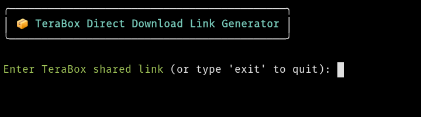

# TeraBox Direct Download Link Generator

A command-line tool to generate direct download links and file info for TeraBox shared files, using [TeraboxDL](https://github.com/falconthehunter/Terabox) under the hood.  
It features a user-friendly [Rich](https://github.com/Textualize/rich) interface and supports persistent authentication with a custom cookie.

---

## Features

- Generate direct download links for TeraBox shared files
- Display file name and size
- Friendly, colorful CLI interface (Rich)
- Persistent session via saved cookie
- Handles errors and invalid links gracefully

---
## Preview



## Prerequisites

- Python 3.7+
- TeraBox account and a valid session cookie

---

## Installation

1. **Clone or Download this Repository**

    ```bash
    git clone https://github.com/falconthehunter/Terabox.git
    cd Terabox
    ```

2. **Install Required Dependencies**

    ```bash
    pip install TeraboxDL
    pip install rich
    ```

    _Required packages:_
    - `rich`
    - `TeraboxDL` (make sure the [TeraboxDL](https://github.com/falconthehunter/Terabox) library is installed and accessible)

---

## Configuration

- **COOKIE**:  
  Replace the value of `COOKIE` in the script with your own TeraBox session cookie string.

    ```
    COOKIE = "lang=en; ndus=YOUR_NDUS_COOKIE_VALUE"
    ```

    You can obtain your cookie from your browser's developer tools after logging into TeraBox.

---

## Usage

Run the script from your terminal:

```bash
python script.py
```

You will be prompted to enter a TeraBox shared link.  
Type `exit` to quit the program.

**Example interaction:**
```
📦 TeraBox Direct Download Link Generator

Enter TeraBox shared link (or type 'exit' to quit): https://terabox.com/s/1abcXYZ...

✅ File Info:
📁 File Name: MyVideo.mp4
📦 File Size: 800 MB

🔗 Direct Download Link:
https://download-link-generated-by-teraboxdl.com/abc123...
```

---

## Notes

- Your TeraBox cookie is required for authentication.  
- The script suppresses the TeraboxDL banner for a cleaner output.
- If you encounter errors, check that your cookie is valid and not expired.

---

## Credits

- Built with [Rich](https://github.com/Textualize/rich) for CLI enhancements
- Powered by [TeraboxDL](https://github.com/falconthehunter/Terabox) for TeraBox link processing

---

## License

MIT License (or your license here)
